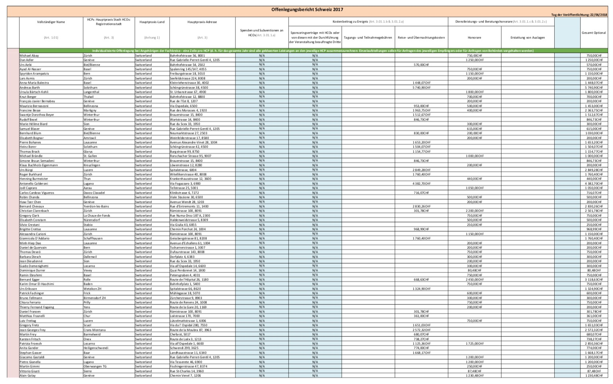
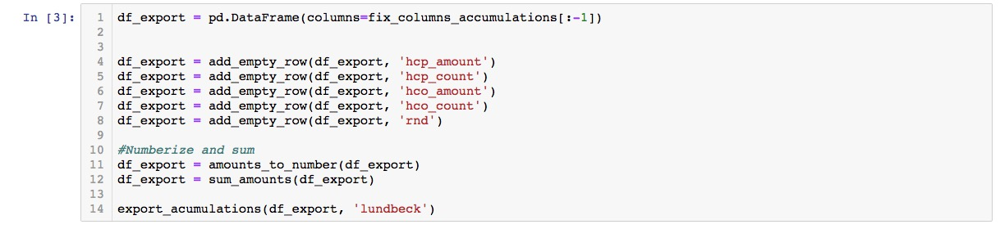
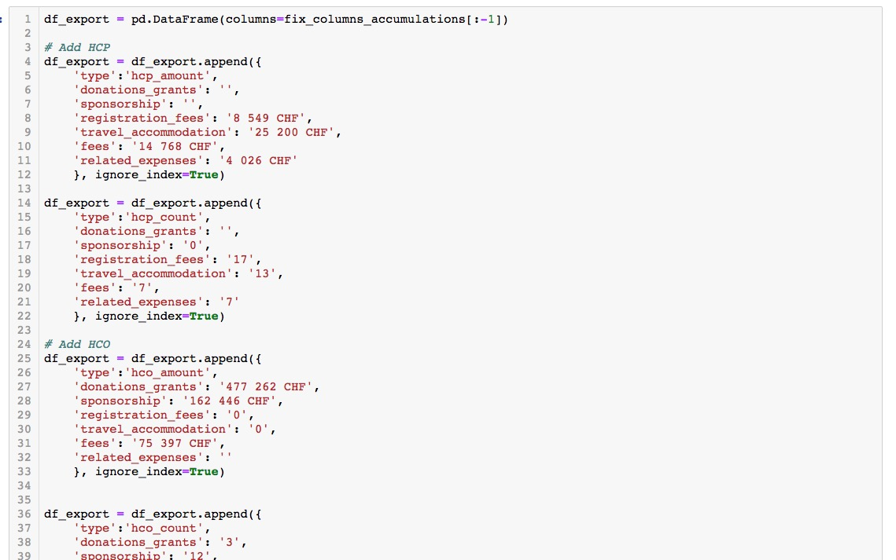

# PDF Types
## [Grün einfach - Pierre](http://localhost:8888/notebooks/data/1.%20pdfexport/files/Pierre%20Fabre%20Pharma/0.%20Lists.ipynb)

## [Grün multitable-warning - MSD](http://localhost:8888/notebooks/data/1.%20pdfexport/files/MSD/0.%20Lists.ipynb)

## [Fancy Small - Celgene](http://localhost:8888/notebooks/data/1.%20pdfexport/files/Celgene/1.%20Accumulations.ipynb)

## [Accumulations leer - Lundbeck](http://localhost:8888/notebooks/data/1.%20pdfexport/files/Lundbeck/1.%20Accumulations.ipynb)

## [Accumulations manuell - Jansen-Cilag](http://localhost:8888/notebooks/data/1.%20pdfexport/files/Jansen-Cilag/1.%20Accumulations.ipynb)

